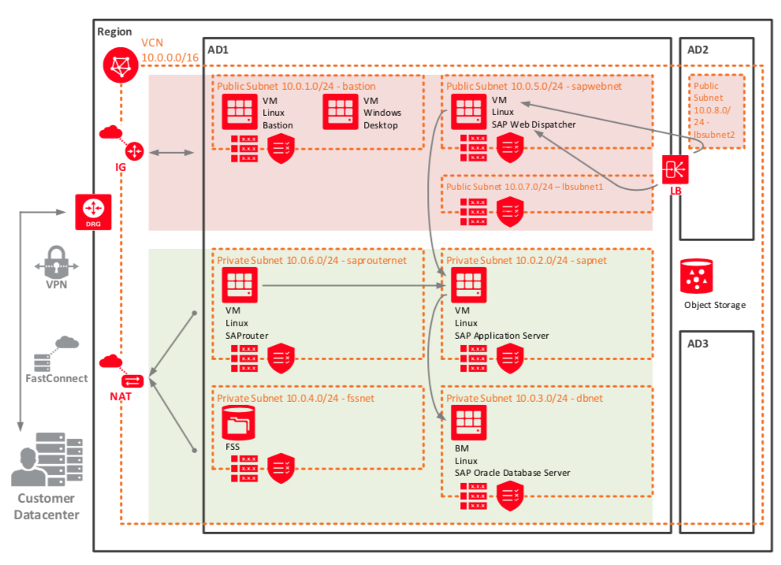

    #     ___  ____     _    ____ _     _____
    #    / _ \|  _ \   / \  / ___| |   | ____|
    #   | | | | |_) | / _ \| |   | |   |  _|
    #   | |_| |  _ < / ___ | |___| |___| |___
    #    \___/|_| \_/_/   \_\____|_____|_____|
***

## NOTICE  
**The OCI Terraform Provider is now available for automatic download through the Terraform Provider Registry. 
For more information on how to get started view the [documentation](https://www.terraform.io/docs/providers/oci/index.html) 
and [setup guide](https://www.terraform.io/docs/providers/oci/guides/version-3-upgrade.html).**

Terraform Provider for Oracle Cloud Infrastructure
==================

- [Documentation](https://www.terraform.io/docs/providers/oci/index.html)
- [OCI forums](https://cloudcustomerconnect.oracle.com/resources/9c8fa8f96f/summary)
- [Github issues](https://github.com/terraform-providers/terraform-provider-oci/issues)
- [Troubleshooting](https://www.terraform.io/docs/providers/oci/guides/guides/troubleshooting.html)

SAP on OCI - Three Tier Architecture
==================

These are Terraform modules for deploying a basic Infrastructure to support SAP on Oracle Cloud Infrastructure (OCI):

* [single-ad](single-ad) deploys all infrastructure on a single availability domain. This is a good fit for people who want to explore SAP on OCI.
  
Prerequisites
---------------------
First off you'll need to do some pre deploy setup.  That's all detailed [here](https://github.com/cloud-partners/oci-prerequisites).

Secondly, customize the SAP on OCI terraform stack based on your requirements like:
•	Define the compartment where the resources will be created by setting the compartment Terraform Variable
### Compartment
export TF_VAR_compartment_ocid="<compartment OCID>"

•	Change VNC password (“VNC_PASSWORD_CHANGE_ME) in script-sap-bast.sh file before running the terraform stack

•	If needed, open additional firewall Ports in the security-lists.tf file and add an “firewall-cmd” CLI into the script file of the node where that port needs to be accessible (i.e.; “sudo firewall-cmd --zone=public --permanent --add-port=80/tcp”

Clone the Module
---------------------
Now, you'll want a local copy of this repo. You can make that with the commands:

    git clone https://github.com/cloud-partners/oci-sap.git
    cd oci-sap
    ls

Deploy
---------------------
Pick a module and `cd` into the directory containing it.  You can deploy with the following Terraform commands:

    terraform init
    terraform plan
    terraform apply

When complete, Terraform will print information on how you can access the deployment.

Destroy the Deployment
---------------------
When you no longer need the deployment, you can run this command to destroy it:

    terraform destroy
